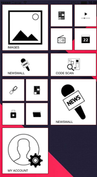
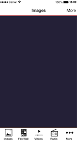
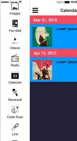
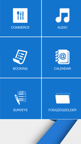
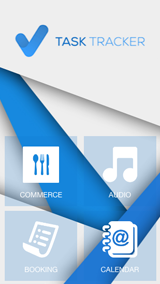
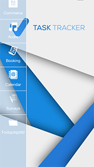
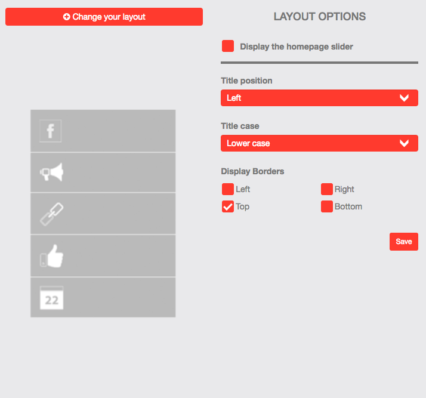

# Layout

[Improve this doc](https://github.com/Xtraball/SiberianCMS-Doc/blob/master/docs/layout.md)

** *Note: layout packages require Siberian 4.5.0 and above, otherwise they will not work* **

Here you'll find everything needed to start developing your first layout, from structure to update routine & packaging.

## What is a layout ?

Layouts are the entry point of your Siberian Applications, they define your application homepage design.

Right here you can find a module skeleton to start with [Siberian layout Skeleton](https://github.com/Xtraball/siberian-layout-skeleton)


### What you need

* A new idea for a cool UI to share !
* Knowledge about html/css/javascript
* Follow these instructions

**And to define two names:**

* Your package name, like `MyAwesomeLayout`.
* Your layout `code`, which should be unique, and limited to 50 characters, like `my_awesome_layout`.

These two names will follow you and ensure your layout is namespaced, avoiding conflicts with any other layout.

&nbsp;

**Side notes:** Your layout should be compatible with most device resolutions, and orientations

## Structure of a layout package

Layouts are installed in the `app/local/modules` folder,
for more information about the inheritance you can read [module/core-inheritance](module/core-inheritance)

&nbsp;

Below is the complete and minimal required structure for a layout as in the layout skeleton

```raw
MyAwesomeLayout.zip
├─ resources
│  ├─ db
│  │  └─ data
│  │     └─ my_awesome_layout.php
│  ├─ design
│  │  └─ desktop
│  │     ├─ flat /** Flat design */
│  │     │  └─ images
│  │     │     └─ customization
│  │     │        └─ layout
│  │     │           └─ homepage
│  │     │              └─ my_awesome_layout.png
│  │     └─ siberian /** Siberian design */
│  │        └─ images
│  │           └─ customization
│  │              └─ layout
│  │                 └─ homepage
│  │                    └─ my_awesome_layout.png
│  └─ var
│     └─ apps
│        └─ modules
│           └─ layout
│              └─ home
│                 └─ my_awesome_layout
│                    ├─ hooks.js
│                    ├─ style.css
│                    └─ view.html
├─ init.php
├─ package.json
└─ [...]
```

### package.json

The `package.json` is used by the Installer to know the requirements, and routines to run during the installation/update process of your layout

```json
{
  "name": "MyAwesomeLayout",
  "description": "MyAwesomeLayout description",
  "type": "layout",
  "version": "1.0",
  "release_note": {
    "url": "http://www.yourdomain.com/your-layout.html",
    "show": true
  },
  "dependencies": {
    "system": {
      "type": "SAE",
      "version": "4.5.0"
    }
  }
}
```

|Field|Required&nbsp;?|Description|
|-----|---------------|-----------|
|name|yes|Package name, avoid spaces and numbers as this is also your Class name & Folder name in `app/local/modules/MyAwesomeLayout/[...]`|
|description|yes|Package description|
|type|yes|must be `layout`|
|version|yes|Your layout version, for updates|
|release_note|no|**url:** link to a valid HTML description to be shown in the modal when installing, **show:** (true/false) to force display|
|dependencies|yes|**version*:** 4.5.0 minimum, **type:** SAE/MAE/PE minimum installation type required|

** * version must be at least 4.5.0**

### Bootstrap

**Note: the `bootstrap.php` file is deprecated since Siberian 5.0 see the Init section below for the new flavor**

We use `bootstrap.php` to hook & register the layout files into Siberian & update assets.

```php
<?php
/**
 * @deprecated from Siberian 5.0, see Init.
 */
class MyAwesomeLayout_Bootstrap {

    public static function init($bootstrap) {
        # Register assets
        # This path must be "/app/local/modules/MyAwesomeLayout/resources/var/apps/"
        # Where "MyAwesomeLayout" is your layout package name #what-you-need
        Siberian_Assets::registerAssets(
            "MyAwesomeLayout", 
            "/app/local/modules/MyAwesomeLayout/resources/var/apps/"
        );
        
        # Hook javascript to index.html
        # These path are relative to the previously defined before:
        # "/app/local/modules/MyAwesomeLayout/resources/var/apps/"
        Siberian_Assets::addJavascripts(array(
            "modules/layout/home/my_awesome_layout/hooks.js",
        ));
        
        # Hook stylesheets to index.html
        # These path are relative to the previously defined before:
        # "/app/local/modules/MyAwesomeLayout/resources/var/apps/"
        Siberian_Assets::addStylesheets(array(
            "modules/layout/home/my_awesome_layout/style.css",
        ));
        
        # Register a custom form for the Layout Options
        Siberian_Feature::registerLayoutOptionsCallbacks("my_awesome_layout", "MyAwesomeLayout_Form_MyAwesomeLayout", function($datas) {
            $options = array();
            
            return $options;
        });
    }
}
```


## Init

**The new init syntax is available from Siberian 5.0, this new syntax avoids conflicts with already exisiting bootstrap classes**

The file `init.php` is used to hook & register the layout files into Siberian & update assets.

However the syntax & methods used inside **Init** remains the same as with the older bootstrap files.

```php
<?php

$init = function($bootstrap) {
    # Register assets
    # This path must be "/app/local/modules/MyAwesomeLayout/resources/var/apps/"
    # Where "MyAwesomeLayout" is your layout package name #what-you-need
    Siberian_Assets::registerAssets(
        "MyAwesomeLayout", 
        "/app/local/modules/MyAwesomeLayout/resources/var/apps/"
    );
    
    # Hook javascript to index.html
    # These path are relative to the previously defined before:
    # "/app/local/modules/MyAwesomeLayout/resources/var/apps/"
    Siberian_Assets::addJavascripts(array(
        "modules/layout/home/my_awesome_layout/hooks.js",
    ));
    
    # Hook stylesheets to index.html
    # These path are relative to the previously defined before:
    # "/app/local/modules/MyAwesomeLayout/resources/var/apps/"
    Siberian_Assets::addStylesheets(array(
        "modules/layout/home/my_awesome_layout/style.css",
    ));
    
    # Register a custom form for the Layout Options
    Siberian_Feature::registerLayoutOptionsCallbacks("my_awesome_layout", "MyAwesomeLayout_Form_MyAwesomeLayout", function($datas) {
        $options = array();
        
        return $options;
    });
};
```

`$bootstrap` is a reference to the Zend Bootstrap if you need to hook it.


#### Icon & Image sizing

**Available from version 4.7.10**

If your layout requires custom ratio images to illustrate features, you can register a callback function in the `init.php` to be called like this.

```php
Siberian_Feature::registerRatioCallback("my_awesome_layout", function($position) {
    $sizes = array(
        "width" => 800,
        "height" => 400,
    );
    
    return $sizes;
});

```

`my_awesome_layout` is your unique layout code.

`$position` is the position of the current feature, this way you can have different sizes for different positions in your layout.

the function must return an array with `width` and `height` keys. 

### Data

This file creates & updates the entry in database and copy assets at installation time

If you need to change options in your module while providing an update you must change the values here

**Note:** you must never change `code` as this is the unique_code used to update your layout, otherwise this will create a new layout.

```php
<?php
/** Available in Siberian 4.8.6+ only */
$default_options = Siberian_Json::encode(array(
    "borders" => "border-right",
    "borders" => "border-left",
    "borders" => "border-top",
    "label" => "label-left",
    "textTransform" => "title-lowcase",
));

# MyAwesomeLayout
$datas = array(
    'name'                       => 'MyAwesomeLayout',
    'visibility'                 => Application_Model_Layout_Homepage::VISIBILITY_HOMEPAGE,
    'code'                       => 'my_awesome_layout',
    /** Preview is relative to [...]/resources/design/desktop/[flat|siberian]/images/  */
    'preview'                    => '/customization/layout/homepage/my_awesome_layout.png',
    'use_more_button'            => 1,
    'use_horizontal_scroll'      => 0,
    'number_of_displayed_icons'  => 8,
    'position'                   => "bottom",
    "order"                      => 1200,
    "is_active"                  => 1,
    "use_subtitle"               => 1,
    "use_homepage_slider"        => 1,
    "options"                    => $default_options,
);

$layout = new Application_Model_Layout_Homepage();
$layout
    ->setData($datas)
    ->insertOrUpdate(array("code"));

# Copying assets at installation time
# same path as in `Siberian_Assets::registerAssets`
Siberian_Assets::copyAssets("/app/local/modules/MyAwesomeLayout/resources/var/apps/");
```

|Field|Required&nbsp;?|Description|
|-----|---------------|-----------|
|name|yes|This is your layout name, this can be `My Awesome Layout`|
|visibility|yes|VISIBILITY_HOMEPAGE, VISIBILITY_ALWAYS, VISIBILITY_TOGGLE|
|code|yes|must be your layout_code, here `my_awesome_layout`|
|preview|yes|This is the image used in Design > CHOOSE YOUR LAYOUT section|
|use_more_button|yes|Does your layout works with a modal and so requires the more_button|
|use_horizontal_scroll|yes|-|
|number_of_displayed_icons|yes|The number of features used when using `use_more_button` this populates `features.overview.options`|
|position|yes|Position of your menu: bottom, left, right|
|order|yes|The order in the section Design > CHOOSE YOUR LAYOUT|
|is_active|yes|must be 1|
|use_subtitle|yes|Whether your layout uses subtitles. **/!\ Only available in flat design**|
|use_homepage_slider|no|Whether your layout is designed to work with the homepageslider.|
|options|no|Default options for your layout Siberian 4.8.6+ only|


#### Visibility

|&nbsp;|&nbsp;|&nbsp;|
|------|------|------|
|VISIBILITY_HOMEPAGE|The layout is displayed only on the homepage||
|VISIBILITY_ALWAYS|The layout is displayed everywhere and must take in consideration audio player controls & features UI||
|VISIBILITY_TOGGLE|Toggle layout side-menu||


## Layout Structure

The layout is composed of 3 or 4 files generally, `view.html`, `style.css`, `hooks.js` & if needed `modal.html`

* `view.html` This is the main layout view.
* `style.css` All the corresponding CSS for yout layout
* `hooks.js` This file contains every hooks to tell Ionic what to load & how to arrange features
* `modal.html` If you need to customize the modal this is the file you are searching for otherwise you can use one of the existing modal from Siberian.

### view.html

```html
<div class="layout my_awesome_layout">
	<ul id="container">
		<li class="item homepage-custom"
        	ng-class="{ 'background-transparent' : tabbar_is_transparent, 'no-border' : tabbar_is_transparent }"
        	ng-show="tabbar_is_visible"
        	tabbar-items
        	ng-repeat="feature in features.overview.options"
        	option="feature"
        	go-to-url="goTo(feature);">
        	
        	
        	<h2>{{ feature.name }}</h2>
        	<p ng-if="feature.subtitle">{{ feature.subtitle }}</p>
        </li>
	</ul>
</div> 
```

Your homepage layout needs to be wrapped into a `<div>` with at least two classes first is `layout`, second is `my_awesome_layout`.

---

Each feature is an item and needs some directives:

|Element|Required&nbsp;?|Description|
|-------|---------------|-----------|
|tabbar-items|yes|This directive binds the on-click of your element|
|option="feature"|yes|Sets the option to the current feature|
|go-to-url="goTo(feature);"|yes|**This option is deprecated in Siberian 5.0**|
|ng-show="tabbar_is_visible"|yes|Condition used when the layout is always displayed|
|ng-class="[...]"|yes|Used by the option in Editor > Colors > Homepage > Transparent to remove border & background|

&nbsp;

Elements also use CSS classes to bind their colors upon the application defined color set

|Class|Required&nbsp;?|
|-----|---------------|
|item|yes|
|homepage-custom|yes|

&nbsp;

|Classic|
|----------------|
| |


### style.css

This CSS is the example given in the layout skeleton but with `my_awesome_layout` as namespace

```css
.layout.my_awesome_layout {
    position: absolute;
    bottom: 5vh;
    width: 100%;
}

.layout.my_awesome_layout li.item {
    height: 28px;
    width: 150px;
    border-radius: 0 14px 14px 0;
    padding: 0;
    -o-transform: rotate(-7deg);
    -ms-transform: rotate(-7deg);
    -webkit-transform: rotate(-7deg);
    transform: rotate(-7deg);
    margin-left: -4vw;
    margin-top: 1px;
    border-width: 0px;
}

.layout.my_awesome_layout li.item img {
    float: left;
    height: 80%;
    margin: 2% 0 0 10%;
}

.layout.my_awesome_layout li.item h2 {
    float: left;
}
```

### hooks.js

The hooks.js file is an Angular service, lazy loaded when using a custom Layout, allowing to manipulate features.

```js
/**
 *
 * MyAwesomeLayout example
 *
 * All the following functions are required in order for the Layout to work
 */
App.service('my_awesome_layout', function ($rootScope, HomepageLayout) {

    var service = {};
    
    var _features;

    /**
     * Must return a valid template
     *
     * @returns {string}
     */
    service.getTemplate = function() {
        return "modules/layout/home/my_awesome_layout/view.html";
    };

    /**
     * Must return a valid template
     *
     * @returns {string}
     */
    service.getModalTemplate = function() {
        return "templates/home/l10/modal.html";
    };

    /**
     * onResize is used for css/js callbacks when orientation change
     */
    service.onResize = function() {
        /** Do nothing for this particular one */
    };

    /**
     * Manipulate the features objects
     *
     * Examples:
     * - you can re-order features
     * - you can push/place the "more_button"
     *
     * @param features
     * @param more_button
     * @returns {*}
     */
    service.features = function(features, more_button) {
        /** Keep a copy of the features in your hook */
        _features = features;
        
        /** Place more button at the end */
        features.overview.options.push(more_button);

        return features;
    };

    return service;

});
```

|Function|Description|
|--------|-----------|
|service.getTemplate|Must return the path to the layout file|
|service.getModalTemplate|Must return the path to a valid modal file|
|service.onResize|Called when device orientation is changed or resized and everytime the homepage is shown|
|service.features|Called to manipulate features|

* Default modal templates are `templates/home/l10/modal.html` & `templates/home/modal/view.html`

&nbsp;
&nbsp;

#### Available objects in hook service

`features`

```json
"features": {
  "layoutCode": "my_awesome_layout",
  /** an array of every features in your application see [Option](#option) */
  "options": [...]
}
```

#### Chunk of features defined by the `limit`

`features.overview`

```json
"features.overview": {
  "layoutCode": "my_awesome_layout",
  /** an array of every features in your application see [Option](#option) */
  "options": [...]
}
```

#### Option

Example of an option/feature for information

```json
{
  "value_id": "6",
  "id": 6,
  "layout_id": "1",
  "code": "calendar",
  "name": "Calendar",
  "is_active": "1",
  "url": "http://www.yourdomain.com/57c7f8764a65a/event/mobile_list/index/value_id/6",
  "path": "/57c7f8764a65a/event/mobile_list/index/value_id/6",
  "icon_url": "http://www.yourdomain.com/var/cache/images/e9dcc367471a70a23261056b1129a198.png",
  "icon_is_colorable": "1",
  "is_locked": null,
  "is_link": false,
  "use_my_account": "0",
  "use_nickname": "0",
  "use_ranking": "0",
  "custom_fields": [],
  "position": "5"
}
```

#### Other `service.features = function(features, more_button)` examples

In the example below, we are placing the `more_button` at the third place in the `features.overview.options` array.

```js
[...]
    /**
     * Example with a layout containing 5 features (more_button include) & a modal
     */
    service.features = function(features, more_button) {
        if(features.overview.options >= 4) {
  
            var third_option = features.overview.options[2];
            var fourth_option = features.overview.options[3];
            
            /** Placing more button at the third place (middle in layout) */
            features.overview.options[2] = more_button;
            features.overview.options[3] = third_option;
            features.overview.options[4] = fourth_option;
            
            /** Removing 4 first option for the modal */
            features.options = features.options.slice(4, features.options.length);
            
        } else {
            features.overview.options.push(more_button);
        }
        
        return features;
    };
[...]
```

&nbsp;

The second example is used by the `Apartments` layout to create chunks of features.

```js
[...]
    service.features = function(features, more_button) {
        _features = features;
    
        var more_options = features.options.slice(12);
        var chunks = new Array();
        var i, j, temparray, chunk = 2;
        for (i = 0, j = more_options.length; i < j; i += chunk) {
            temparray = more_options.slice(i, i + chunk);
            chunks.push(temparray);
        }
        features.chunks = chunks;
        
        return features;
    };
[...]
```

## Layout Options

In the version 4.8.6 we introduced new Layout options, you can offer easy customization of your layouts to the final user with a simple form.

If you want to add custom options to your layout you must create a Form and register it in your init.

```raw
MyAwesomeLayout.zip
└─ Form
   └─ MyAwesomeLayout.php
```

### Init hook

```php
# Register a custom form for the Layout Options
Siberian_Feature::registerLayoutOptionsCallbacks("my_awesome_layout", "MyAwesomeLayout_Form_MyAwesomeLayout", function($datas) {
    $options = array();
    
    return $options;
});
```

### Form options

Here is a simple example of what the form could look (from Layout 18).



And the example code

```php
<?php

class MyAwesomeLayout_Form_MyAwesomeLayout extends Siberian_Form_Options_Abstract {


    public function init() {
        parent::init();

        /** Bind as a create form */
        self::addClass("create", $this);
        self::addClass("form-layout-options", $this);

        $label = $this->addSimpleSelect("label", __("Title position"), array(
            "label-left" => __("Left"),
            "label-right" => __("Right"),
        ));

        $textTransform = $this->addSimpleSelect("textTransform", __("Title case"), array(
            "title-lowcase" => __("Lower case"),
            "title-uppercase" => __("Upper case"),
        ));

        $borders = $this->addSimpleMultiCheckbox("borders", __("Display Borders"), array(
            "border-left" => __("Left"),
            "border-right" => __("Right"),
            "border-top" => __("Top"),
            "border-bottom" => __("Bottom"),
        ));

        $this->addNav("submit", __("Save"), false, false);

        self::addClass("btn-sm", $this->getDisplayGroup("submit")->getElement(__("Save")));

    }

}
```

Your form `MUST` inherit `Siberian_Form_Options_Abstract` class.

Then you can add your options.

### style.css

And the view.html & style.css examples

Here in the style.css we are using classes with the same names as the form values below, this is one way of doing it.

```css
[...]
.layout.layout_siberian_18 .label-right {
    text-align: right;
}
.layout.layout_siberian_18 .label-left {
    text-align: left;
}

.layout.layout_siberian_18 .title-lowcase {
    text-transform: inherit;
}
.layout.layout_siberian_18 .title-uppercase {
    text-transform: uppercase;
}
[...]
```

### view.html

And then in the view.html

```html
<div class="layout layout_siberian_18">
	<ion-scroll direction="y" scrollbar-y="false" class="scroll-view ionic-scroll">
		<div ng-repeat="feature in features.options">
			<a tabbar-items class="item item-avatar item-avatar-square homepage-custom border-custom {{ features.layoutOptions.borders.join(' ') }}" option="feature" go-to-url="goTo(feature)" ng-class="{ 'no-border': tabbar_is_transparent }">
				
				<h2 class="{{ features.layoutOptions.label+' '+features.layoutOptions.textTransform }}">{{ feature.name }}</h2>
				<span ng-if="feature.code == 'push_notification' && push_badge" class="badge badge-assertive">{{ push_badge }}</span>
			</a>
		</div>
	</ion-scroll>
</div>
```

Here we are using a simple javascript "join" to concatenate all the selected options which have the same classes names.

For the multi-select

`{{ features.layoutOptions.borders.join(' ') }}`

And for the simple selects we only echo the class, or classes

`{{ features.layoutOptions.label+' '+features.layoutOptions.textTransform }}`

### Advanced usage of the options

In the layout swiper, we are using the options to configure the Slider javascript object

Here is an example of how we do it.

in our hooks.js file, within the onResize function

```js
/**
 * onResize is used for css/js callbacks when orientation change
 */
service.onResize = function() {
    
    var options = _features.layoutOptions;
    /** Do nothing for this particular one */
    var time_out = ($rootScope.isOverview) ? 1000 : 200;
    
    $timeout(function() {
        if(swipe_instance != null && typeof swipe_instance.destroy == "function") {
            swipe_instance.destroy(true, false);
        }
        swipe_instance = new Swiper('.layout.layout_siberian_swipe .swiper-container', {
            direction: 'vertical',
            loop: (options.loop == "1") ? true : false,
            effect: 'coverflow',
            centeredSlides: true,
            initialSlide: (options.backcurrent == "1") ? service.last_index : 0,
            slidesPerView: 'auto',
            loopedSlides: 6,
            coverflow: {
                rotate: options.angle,
                stretch: options.stretch,
                depth: options.depth,
                modifier: 1,
                slideShadows : false
            }
        });

    }, time_out);
};
```

previously we saved the `_features` array in the features function, and thus can use it.

However, you can also access the layout options here

`HomepageLayout.layoutOptions`

## Package

When you are done with your layout, it's time to pack !

zip everything at the root of your layout and you're done !

If you have created your own module from the [skeleton](https://github.com/Xtraball/siberian-layout-skeleton), you can run `./tools.pack.sh` and voila !

```raw
MyAwesomeLayout.zip
├─ resources
├─ init.php
└─ package.json
```
