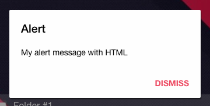
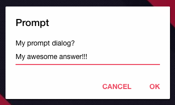
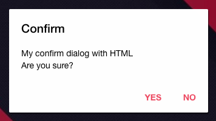
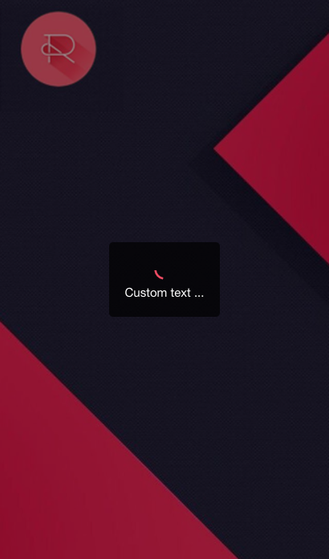
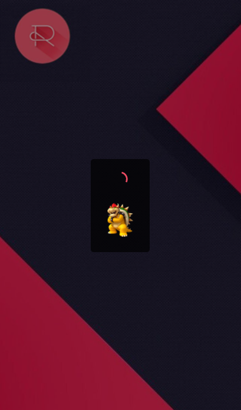

# Ionic Tools

[Edit this on Github](https://github.com/Xtraball/SiberianCMS-Doc/edit/master/docs/stack/ionic-tools.md)

**Note: The documentation below will apply only after the Siberian 4.12.0 release.**

# Dialog

The `Dialog` service is used to handle `Alert`, `Prompt` & `Confirm` popups taking care of the stack, and extended with nice features.
This service also takes care of the translations, every `String` goes into `$translate.instant(text)`

Dialog methods always return a promise

## Alert

```js
Dialog.alert(title, message, button, dismiss);
```



#### options

|Key|Type|Default|Usage|
|---|---|---|---|
|title|String|---|Dialog title|
|message|String|---|Dialog message `text`|
|button|String|---|Dialog button text, dismiss or ok|
|dismiss|Integer|undefined|When defined, the Dialog will automatically dismiss after the given time in ms, if set to `-1` the dismiss time will be calculated automatically|

## Prompt

```js
Dialog.prompt(title, message, type, value);
```



#### options

|Key|Type|Default|Usage|
|---|---|---|---|
|title|String|---|Prompt title|
|message|String|---|Prompt message `text`|
|type|String|text|`text` or `password`, defaults to `text` if undefined|
|value|String|undefined|Placeholder if type is set to `text`|


## Confirm

```js
Dialog.confirm(title, message, buttons_array, css_class);

Dialog.confirm(title, message, buttons_array, css_class)
    .then(function (result) {
        if (result) {
            // Confirmed
        } else {
            // Cancelled
        }
    });
```



#### options

|Key|Type|Default|Usage|
|---|---|---|---|
|title|String|---|Confirm title|
|message|String|---|Confirm message `text`|
|buttons_array|Array|---|`["YES","NO"]`|
|css_class|String|undefined|CSS class used to customize render|

&nbsp;

&nbsp;

----

# Modal

This Modal service is using $ionicModal but will take cares of the stacking, the parameters & config are the same as the $ionicModal ones.

The service also takes care of removing the Modal when closing via `modal.hidden` subscribers.

The Modal service returns a promise with the modal object

## fromTemplateUrl

```js
Modal.fromTemplateUrl(templateUrl, config);

Modal.fromTemplateUrl(templateUrl, config)
    .then(function (modal) {
        // Do Whatever you want with your modal!
    });
```

## fromTemplate

```js
Modal.fromTemplate(template, config);
```

&nbsp;

&nbsp;

----

# Loader

With this loader wrapper, you can only open the Loader once.
Also the loader comes with a backdrop modal preventing any action!

## Show

```js
Loader.show(text, config);
```

#### default

```js
Loader.show()
```


#### example with text

```js
Loader.show("Custom text...")
```



#### example with image

```js
Loader.show("<br />")
```



## Hide

```js
Loader.hide();
```


&nbsp;

&nbsp;

----

# Location

The location services is used to get the current position, with freshness rules to avoid GPS Spam.

## getLocation

#### usage 

```js
Location.getLocation(config, force)
    .then(function(position) {
        /** position: {
                coords: {
                    latitude  
                    longitude 
                    altitude
                    accuracy
                    altitudeAccuracy
                    heading
                    speed
                }
                timestamp                
            }
        */
    }, function(error) {
        // action on error
    })
```

Returns a promise

If `force` is set to true the GPS request will be immediate, otherwise if the latest fetch is less than 10 seconds, 
it will return the latest saved position within the promise then refresh it in background.

&nbsp;

#### default config

```js
{
    enableHighAccuracy  : true,
    timeout             : 10000,
    maximumAge          : 0
}
```

## getLatest

```js
Location.getLatest()
    .then(function(position) {
        /** position: {
                coords: {
                    latitude  
                    longitude 
                    altitude
                    accuracy
                    altitudeAccuracy
                    heading
                    speed
                }
                timestamp                
            }
        */
    }, function(error) {
        // action on error
    })
```

Returns a promise

Get latest will return the latest position, without taking care of the freshness, 
if the position was never fetched, it will try to fetch it however.


&nbsp;

&nbsp;

----

# Picture

The picture service will prompt for whether importing a Picture from your library or Taking a new with the Camera.

## takePicture

```js
Picture.takePicture(width, height, quality)
    .then(function(response) {
        /** 
            The image is returned in base64.
            response: {
                image
            }
        */
    }, function(error) {
        // action on error
    })
```

#### options

|Key|Type|Default|Usage|
|---|---|---|---|
|width|Integer|1200|Max width in pixel|
|height|Integer|1200|Max height in pixel|
|quality_array|Integer|90|Picture quality 0-100|


&nbsp;

&nbsp;

----

# SocialSharing

## share

```js
SocialSharing.share(content, message, subject, link, file)
```

When using `SocialSharing.share()` with no parameters, the default message will be `Hi. I just found this in the MyAwesomeApp app.`

&nbsp;

If only `content` is defined, `this` will be replace by `content`, like `Hi. I just found a new awesome music in the MyAwesomeApp app.`

&nbsp;

When defining `message` it will completely override the default message including `content`, like `Just wanted to share this song with you guy's`
but you can use `$1` as a placeholder for `content`, and `$2` as a placeholder for the Application name, like `Just wanted to share $1 with you guy's, in the App $2`

&nbsp;

`link` will default to the Application download link

&nbsp;

#### options

|Key|Type|Default|Usage|
|---|---|---|---|
|content|String|undefined|Default placeholder text|
|message|String|undefined|Message replacing the default one|
|subject|String|undefined|Subject or your shared message|
|link|String|undefined|Default to the Application download link|
|file|String|undefined|A file url, an album cover or pdf for example|

&nbsp;

&nbsp;

----

# Customer

The customer service, is the only entry point you should use when dealing with user accounts, this in order to avoid any unwanted and/or duplicated behaviors.


## loginModal


```js
Customer.loginModal(scope, login_callback, logout_callback)
```

&nbsp;

#### options

|Key|Type|Default|Usage|
|---|---|---|---|
|scope|Object|undefined|If undefined, the scope will be $rootScope|
|login_callback|Function|undefined|A function to be called on a sucessfull login|
|logout_callback|Function|undefined|A function to be called on a sucessfull logout|

&nbsp;

&nbsp;

----

# $session

The session provider contains the session id, the uid, and the screen resolution.

This service is also used to store session data in localStorage.

## getId

```js
$session.getId()
```

## getDeviceUid

```js
$session.getDeviceUid()
```

## getDeviceScreen

```js
$session.getDeviceScreen()

/**
{
    width,
    height
}
*/
```

## setItem

```js
$session.setItem(key, value)
```

## getItem

```js
$session.getItem(key)
    .then(function(value) {
        // the retrieved value, or null if it doesn't exists
    });
```

## removeItem

```js
$session.removeItem(key)
```
